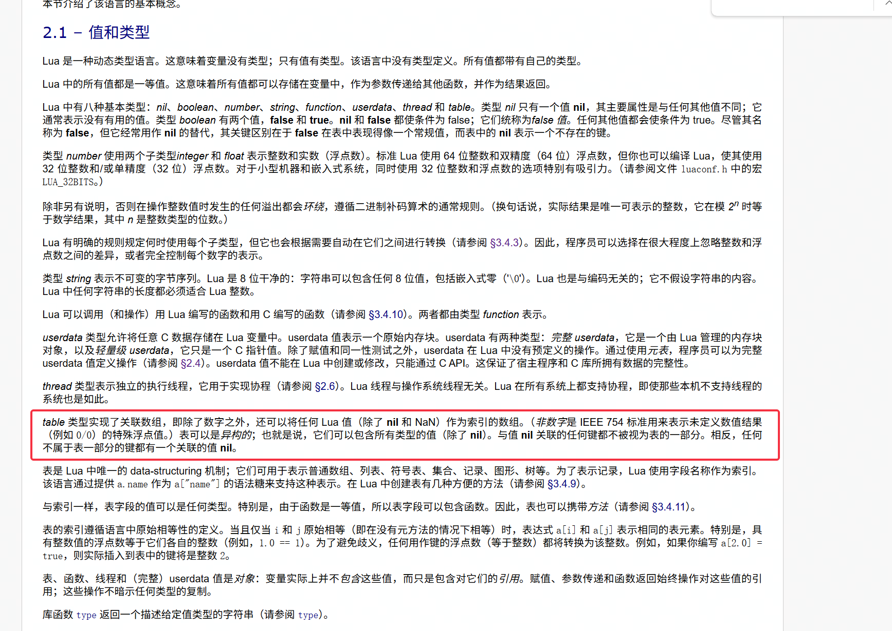

**问题背景**

设置_G元表的__index元方法，主要是为了当逻辑中访问了不存在的全局变量时收集报错，并发送到报错日志收集服务器，方便定位问题

<div style="display:inline-block;"></div>

<!-- more -->
在上面设置的基础上，会存在类似情况报错

<div style="display:inline-block;"></div>

玩家按下SPACE后报错如下：

<div style="display:inline-block;"></div>


**问题分析**

__index元方法定义为访问表中不存在的key时所触发的函数，那Lua是如何判断这个key是否存在的呢？标准是怎么样的呢？

上图执行了testGV = nil后，_G元表中到底是否存在testGV这个key呢？

在解决这个问题之前，其实我是顾名思义的认为__G元表中存在testGV这个key的，这个key对应的值为nil，但其实这不对，且看后续详解


**Lua官方文档参考**

**1. table** 

“与值 **nil** 关联的任何键都不被视为表的一部分。相反，任何不属于表一部分的键都有一个关联的值 **nil**。”

访问一个表中不存在（从未显式定义）的键会返回nil，设置表格中某个键对应的值为nil，可以理解为表格中删除这个键。

<div style="display:inline-block;"></div>


**2. __index** 

网上文档通常这么解释：“在Lua中，**__index**是元表中最常用的键之一。它的作用是在你尝试访问表中不存在的键时，Lua会尝试在该表的元表中查找**__index**键。如果**__index**存在，Lua会根据它的类型（表或函数）来决定如何获取值。”

实际上，即使我们显式定义了某个全局变量为nil后，_G表中仍然视为表中不存在这个键

大白话来说，当table中某个value是nil时，lua没法区分这个nil是不是刻意显式设置的，还是一个确实不存在的键

第一点提到的官方文档也佐证这一点，下面例子的实际输出也论证了这一点

```lua
-- 创建一个带有 __index 元方法的表
local myTable = setmetatable({}, {
    __index = function(t, key)
        print("Key " .. tostring(key) .. " not found in myTable")
        return nil
    end
})

-- 设置表中某个键的值为 nil
myTable.existing_key = nil

-- 测试访问显式定义但值为 nil 的键
print("Accessing existing_key:")
print(myTable.existing_key)  -- 按照网上文档应该不会触发 __index

-- 测试访问不存在的键
print("Accessing nonexistent_key:")
print(myTable.nonexistent_key)  -- 按照网上文档应该会触发 __index


---实际输出
`
Accessing existing_key:
Key existing_key not found in myTable
nil
Accessing nonexistent_key:
Key nonexistent_key not found in myTable
`
```


**报错分析**

全局变量LDBG其实在debugger.lua中显式定义过，只不过在平台环境下会是nil

那么平台环境下访问LDGB自然会触发_G __index，导致报错。实际上LDBG在平台环境也不会执行任何逻辑（明明我压根没用上这个功能模块，但是却报错了，也会让人十分疑惑）

```lua
--准备重启游戏
function M.prepareForRestart()
    local arg = GameAPI.lua_get_start_args()
    y3.player.with_local(function (local_player)
        M.notify('prepareForRestart', {
            -- LDBG 其实在debugger.lua中显式定义过，只不过在平台环境下会是nil
            debugger = LDBG
                and (arg['lua_wait_debugger'] == 'true'
                  or arg['lua_multi_wait_debugger'] == 'true'),
            id = LDBG
                and arg['lua_multi_mode'] == 'true'
                ---@diagnostic disable-next-line: deprecated
                and local_player:get_id()
                or nil,
        })
    end)
end

y3.game:event_on('$Y3-即将切换关卡', function ()
    M.prepareForRestart()
end)
```


**推荐解决方案**

当table中某个value是nil时，Lua没法区分这个nil是不是刻意显式设置的，还是一个确实不存在的键

可以在 __index 元方法中添加逻辑，忽略特定的全局变量。例如，可以使用一个白名单来管理这些变量。

```lua
local ignoredGlobals = {
    LDGB = true
}

setmetatable(_G, {
    __newindex = function(_, key, value)
        rawset(_G, key, value) -- 允许创建新全局变量
    end,
    __index = function(_, key)
        if ignoredGlobals[key] then
            return nil  -- 忽略特定变量
        end

        local info = debug.getinfo(2, "Sl") -- 获取调用栈信息
        if not info or not info.short_src or info.what ~= "Lua" then
            -- 过滤掉 C 代码、框架代码等
            return nil
        end

        -- 只记录玩家脚本里的错误
        local err = string.format("[未定义变量] %s:%d 变量: %s", info.short_src, info.currentline, tostring(key))
        local stack = debug.traceback(err, 2)
        error(err, 2) -- 抛出错误
    end
})
```

解决这个问题的卡点在于自己总是带入一些个人习惯性的理解，比如认为“顾名思义的认为__G元表中存在testGV这个key的，这个key对应的值为nil”，实际只要认真去看看官方文档也就能找到答案（百度针对这个问题的各式各样文档实在过于模糊，这也导致花费了更多事件解决这个问题）
